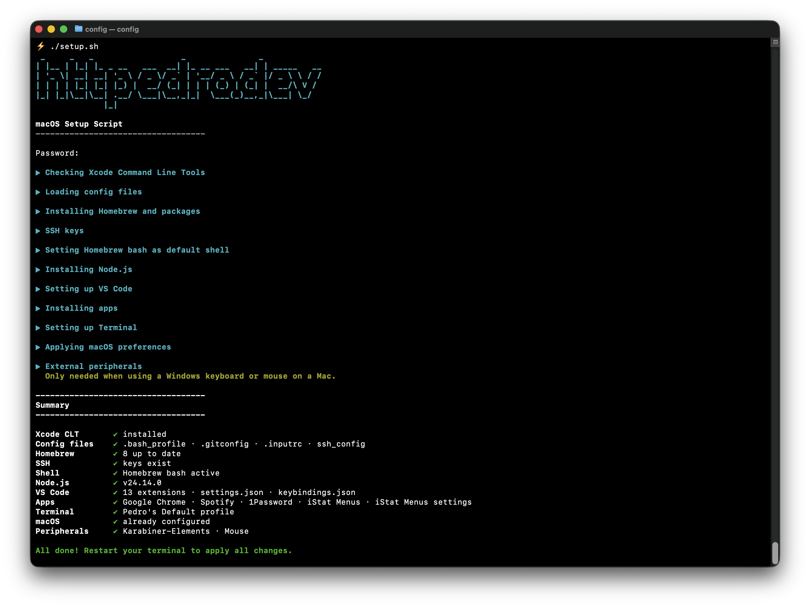

# Config

My personal setup for a new Mac. Run the script or follow the checklist below.

```bash
git clone git@github.com:pedrofelipe/config.git && cd config && ./setup.sh
```

Pass `--dry-run` to preview what the script would do without making any changes.

```bash
./setup.sh --dry-run
```

Pass `--verbose` to see per-item detail for each step.

```bash
./setup.sh --verbose
```



## Contents
| File | Description |
| --- | --- |
| `.bash_profile` | Customizes the Terminal.app prompt and shows the currently checked-out Git branch |
| `.gitconfig` | Global Git configuration with my name, email, aliases, colors, and more |
| `.inputrc` | Makes tab completion case-insensitive |
| `ssh_config` | SSH client config — persists keys in the macOS keychain agent across reboots |
| `settings.json` | Custom settings for Visual Studio Code |
| `keybindings.json` | Custom set of key bindings for Visual Studio Code |
| `setup.sh` | Automated setup script for a fresh macOS install |
| `karabiner.json` | Karabiner-Elements config — remaps Ctrl↔Cmd and Alt+Tab on external keyboards |
| `istatmenus.menubar.plist` | iStat Menus display preferences — which modules show in the menubar and menu |

## Checklist

### 0. Install Xcode Command Line Tools

Required by Homebrew and Git. If not already installed, macOS will prompt you automatically when you run the setup script. To install manually:

```bash
xcode-select --install
```

### 1. Load config files
- [ ] Load [`.bash_profile`](/.bash_profile)
- [ ] Load [`.gitconfig`](/.gitconfig)
- [ ] Load [`.inputrc`](/.inputrc)

### 2. Set up Homebrew and install packages
- [ ] Install [Homebrew](http://brew.sh)
- [ ] Install the latest bash, git, and other packages

```bash
/bin/bash -c "$(curl -fsSL https://raw.githubusercontent.com/Homebrew/install/HEAD/install.sh)"
brew install bash
brew install git
brew install bash-completion@2
brew install yarn
brew install gh
brew install dockutil
brew install --cask claude-code
brew install --cask font-fira-code
```

### 3. Copy or create SSH keys
- [ ] Load [`ssh_config`](/ssh_config) to `~/.ssh/config` so keys persist in the keychain across reboots

```bash
mkdir -p ~/.ssh && chmod 700 ~/.ssh
cp ssh_config ~/.ssh/config && chmod 600 ~/.ssh/config
```

- [ ] Copy existing SSH keys to `~/.ssh`, or let the setup script generate new ones

If no key exists, `setup.sh` generates `~/.ssh/id_ed25519`, adds it to the macOS keychain agent, and uploads it to GitHub via `gh ssh-key add` (prompting for `gh auth login` if needed). Confirm at [github.com/settings/keys](https://github.com/settings/keys).

### 4. Switch from zsh to bash
- [ ] Set Homebrew bash as the default shell

```bash
echo "/opt/homebrew/bin/bash" | sudo tee -a /etc/shells
chsh -s /opt/homebrew/bin/bash
```

### 5. Set up Node.js
- [ ] Install [nvm](https://github.com/creationix/nvm)
- [ ] Install the latest [Node.js](https://nodejs.org/en) LTS version
- [ ] Set as the default Node.js version

```bash
curl -o- https://raw.githubusercontent.com/nvm-sh/nvm/v0.40.4/install.sh | bash
nvm install --lts
nvm alias default node
```

### 6. Set up VS Code
- [ ] Install [Visual Studio Code](https://code.visualstudio.com) via Homebrew

```bash
brew install --cask visual-studio-code
```

- [ ] Install the `code` CLI: open VS Code, open the Command Palette (`Cmd+Shift+P`), and run `Shell Command: Install 'code' command in PATH`
- [ ] Install extensions
  - [ ] [Auto Close Tag](https://marketplace.visualstudio.com/items?itemName=formulahendry.auto-close-tag)
  - [ ] [City Lights Icon](https://marketplace.visualstudio.com/items?itemName=Yummygum.city-lights-icon-vsc)
  - [ ] [Claude Code](https://marketplace.visualstudio.com/items?itemName=anthropic.claude-code)
  - [ ] [Colorize](https://marketplace.visualstudio.com/items?itemName=kamikillerto.vscode-colorize)
  - [ ] [ESLint](https://marketplace.visualstudio.com/items?itemName=dbaeumer.vscode-eslint)
  - [ ] [GitHub Theme](https://marketplace.visualstudio.com/items?itemName=GitHub.github-vscode-theme)
  - [ ] [GitLens](https://marketplace.visualstudio.com/items?itemName=eamodio.gitlens)
  - [ ] [Import Cost](https://marketplace.visualstudio.com/items?itemName=wix.vscode-import-cost)
  - [ ] [npm Intellisense](https://marketplace.visualstudio.com/items?itemName=christian-kohler.npm-intellisense)
  - [ ] [Path Intellisense](https://marketplace.visualstudio.com/items?itemName=christian-kohler.path-intellisense)
  - [ ] [Prettier](https://marketplace.visualstudio.com/items?itemName=esbenp.prettier-vscode)
  - [ ] [Sort Lines](https://marketplace.visualstudio.com/items?itemName=Tyriar.sort-lines)
  - [ ] [Tailwind CSS IntelliSense](https://marketplace.visualstudio.com/items?itemName=bradlc.vscode-tailwindcss)
- [ ] Apply [`settings.json`](/settings.json)
- [ ] Apply [`keybindings.json`](/keybindings.json)

### 7. Install apps

```bash
brew install --cask google-chrome
brew install --cask spotify
brew install --cask 1password
brew install --cask istat-menus
```

After installing iStat Menus, `setup.sh` merges [`istatmenus.menubar.plist`](/istatmenus.menubar.plist) into the app's preferences using Python — updating only the display settings while preserving any existing license and device data.

### 8. Set up Terminal

The setup script configures Terminal automatically. To do it manually:

```bash
TERM_PLIST="$HOME/Library/Preferences/com.apple.Terminal.plist"

# Duplicate Basic profile and rename
/usr/libexec/PlistBuddy -c "Copy :Window Settings:Basic ':Window Settings:Pedro'\''s Default'" "$TERM_PLIST"
/usr/libexec/PlistBuddy -c "Set ':Window Settings:Pedro'\''s Default:name' 'Pedro'\''s Default'" "$TERM_PLIST"

# Font and background
osascript -e 'tell application "Terminal" to set font name of settings set "Pedro'\''s Default" to "SFMonoTerminal-Regular"'
osascript -e 'tell application "Terminal" to set font size of settings set "Pedro'\''s Default" to 14'
osascript -e 'tell application "Terminal" to set background color of settings set "Pedro'\''s Default" to {0, 0, 0}'

# Profile settings
/usr/libexec/PlistBuddy -c "Set ':Window Settings:Pedro'\''s Default:BackgroundBlur' 0.5" "$TERM_PLIST"
/usr/libexec/PlistBuddy -c "Set ':Window Settings:Pedro'\''s Default:shellExitAction' 0" "$TERM_PLIST"
/usr/libexec/PlistBuddy -c "Set ':Window Settings:Pedro'\''s Default:ShowActiveProcessInTitle' false" "$TERM_PLIST"
/usr/libexec/PlistBuddy -c "Set ':Window Settings:Pedro'\''s Default:ShowDimensionsInTitle' false" "$TERM_PLIST"
/usr/libexec/PlistBuddy -c "Set ':Window Settings:Pedro'\''s Default:ShowShellCommandInTitle' false" "$TERM_PLIST"
/usr/libexec/PlistBuddy -c "Set ':Window Settings:Pedro'\''s Default:ShowWindowSettingsNameInTitle' false" "$TERM_PLIST"
/usr/libexec/PlistBuddy -c "Set ':Window Settings:Pedro'\''s Default:ShowRepresentedURLInTitle' true" "$TERM_PLIST"
/usr/libexec/PlistBuddy -c "Set ':Window Settings:Pedro'\''s Default:ShowRepresentedURLPathInTitle' false" "$TERM_PLIST"

# Set as default
defaults write com.apple.Terminal "Default Window Settings" -string "Pedro's Default"
defaults write com.apple.Terminal "Startup Window Settings" -string "Pedro's Default"
defaults write com.apple.Terminal NewWindowWorkingDirectoryBehavior -int 2
defaults write com.apple.Terminal NewTabWorkingDirectoryBehavior -int 2
```

### 9. macOS Preferences

```bash
  # Dock
  # Move Dock to the left side
  defaults write com.apple.dock orientation left

  # Set Dock icon size
  defaults write com.apple.dock tilesize -integer 40

  # Lock Dock from being resized
  defaults write com.apple.dock size-immutable -bool true

  # Minimize windows to app icon
  defaults write com.apple.dock minimize-to-application -bool true

  # Don’t show recent applications in Dock
  defaults write com.apple.dock show-recents -bool false

  # Set Dock app layout (requires dockutil)
  dockutil --remove all --no-restart
  dockutil --add "/Applications/Google Chrome.app" --no-restart
  dockutil --add "/Applications/Visual Studio Code.app" --no-restart
  dockutil --add "/System/Applications/Utilities/Terminal.app" --no-restart
  dockutil --add "/Applications/1Password.app" --no-restart
  dockutil --add "/Applications/Spotify.app" --no-restart

  # Disable hot corners
  defaults write com.apple.dock wvous-tl-corner -int 1
  defaults write com.apple.dock wvous-tr-corner -int 1
  defaults write com.apple.dock wvous-bl-corner -int 1
  defaults write com.apple.dock wvous-br-corner -int 1

  # Finder
  # Show hidden files in Finder
  defaults write com.apple.finder AppleShowAllFiles true

  # Show path bar in Finder
  defaults write com.apple.finder ShowPathbar -bool true

  # Hide recent tags in Finder sidebar
  defaults write com.apple.finder ShowRecentTags -bool false

  # Use icon view by default
  defaults write com.apple.finder FXPreferredViewStyle -string "icnv"

  # Open new Finder windows to Home folder
  defaults write com.apple.finder NewWindowTarget -string "PfHm"

  # When performing a search, search the current folder by default
  defaults write com.apple.finder FXDefaultSearchScope -string "SCcf"

  # Show external drives on desktop
  defaults write com.apple.finder ShowExternalHardDrivesOnDesktop -bool true

  # Show hard drives on desktop
  defaults write com.apple.finder ShowHardDrivesOnDesktop -bool true

  # Prevent .DS_Store files on network drives
  defaults write com.apple.desktopservices DSDontWriteNetworkStores -bool true

  # System Settings
  # Enable tap to click for trackpad
  defaults write com.apple.driver.AppleBluetoothMultitouch.trackpad Clicking -bool true

  # Disable keyboard autocorrect
  defaults write NSGlobalDomain NSAutomaticSpellingCorrectionEnabled -bool false

  # Disable autocapitalization
  defaults write NSGlobalDomain NSAutomaticCapitalizationEnabled -bool false

  # Disable smart dashes
  defaults write NSGlobalDomain NSAutomaticDashSubstitutionEnabled -bool false

  # Disable smart periods
  defaults write NSGlobalDomain NSAutomaticPeriodSubstitutionEnabled -bool false

  # Disable smart quotes
  defaults write NSGlobalDomain NSAutomaticQuoteSubstitutionEnabled -bool false

  # Show all file extensions
  defaults write NSGlobalDomain AppleShowAllExtensions -bool true

  # Enable dark mode
  defaults write NSGlobalDomain AppleInterfaceStyle Dark

  # Minimize window on title bar double-click
  defaults write NSGlobalDomain AppleActionOnDoubleClick Minimize

  # Faster key repeat
  defaults write NSGlobalDomain KeyRepeat -int 5
  defaults write NSGlobalDomain InitialKeyRepeat -int 25

  # Mute volume change feedback sound
  defaults write NSGlobalDomain com.apple.sound.beep.feedback -int 0

  # Disable translucent menu bar
  defaults write NSGlobalDomain AppleEnableMenuBarTransparency -bool false

  # Disable window tiling when dragging to screen edge
  defaults write -g EnableTilingByEdgeDrag -bool false

  # Disable window filling when dragging title bar to menu bar
  defaults write -g EnableTilingByMenuBar -bool false

  # Finder
  # Don't warn when changing a file extension
  defaults write com.apple.finder FXEnableExtensionChangeWarning -bool false

  # Screenshots
  # Save to Desktop
  defaults write com.apple.screencapture location -string "$HOME/Desktop"

  # Disable floating thumbnail preview
  defaults write com.apple.screencapture show-thumbnail -bool false

  # Restart Finder and Dock
  killall Finder
  killall Dock
```

### 10. External peripherals

> Only needed when using a Windows keyboard or mouse on a Mac.

#### Karabiner-Elements (keyboard remapping)

Remaps modifier keys on external keyboards only (built-in keyboard unaffected):
- Left Ctrl → Command (swap disabled in Terminal so Ctrl+C/Z/D work as expected)
- Left Windows key → Control
- Alt+Tab → Cmd+Tab (app switcher)

```bash
brew install --cask karabiner-elements
mkdir -p ~/.config/karabiner
cp karabiner.json ~/.config/karabiner/karabiner.json
```

#### Mouse settings

Sets pointer tracking speed and scroll speed on external mice (trackpad unaffected):

```bash
defaults write .GlobalPreferences com.apple.mouse.scaling 0.5
defaults write .GlobalPreferences com.apple.scrollwheel.scaling 0.5
```

## Use it yourself
Fork this repo, or just copy-paste things you need, and make it your own. **Please be sure to change your `.gitconfig` name and email address though!**
